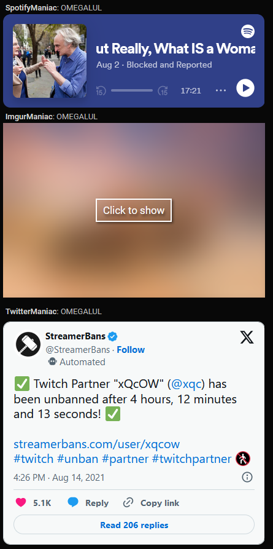

<h1 align="center">
  
    
  
  Embedstiny
</h1>

Embedstiny is a browser extension that allows you to embed links in DGG chat. It works with both Firefox and Chrome browsers.

  
   
  
 
<b>⚠️ Fair warning </b> for Chromium users, the extension will not auto-update. Please check the repo for updates regularly while I am working on a solution

## Features

- Embeds links in DGG chat on the `destiny.gg/embed/chat` and `destiny.gg/bigscreen` pages.
- Allows you to disable embeds for specific domains and types of content.
- Allows you to blur sensitive content.
- Supports YouTube, Twitter, Spotify, Imgur, Streamable, and more.
- Partially compatible with [DGG Chat Everywhere](https://github.com/DannyAlas/DGG-Everywhere)

## Previews

### Options

  

### Chat Embeds

  

## Installation

### Firefox

Embedstiny is available on the Firefox Add-ons store. Simply click the link below to install it.

  

### Chrome

Due to manifest v3 restrictions, Embedstiny is not available on the Chrome Web Store. I am working on a solution, but in the meantime, you can sideload the extension by following the instructions below.

  

1. [Download latest release](https://github.com/JanitorialMess/Embedstiny/releases/latest) and unzip the archive.
2. Open Chrome and go to the Extensions page by clicking the menu button (three vertical dots) in the top-right corner, then selecting "More tools" > "Extensions". Alternatively, you can type `chrome://extensions` in the address bar and press Enter.
3. Enable the "Developer mode" toggle in the top-right corner of the Extensions page.
4. Click the "Load unpacked" button and select the unzipped extension folder to install the extension.

## Permissions required

- `storage` - Required to store user preferences.
- `https://*.destiny.gg/*` - Required to access the DGG chat page.
- `https://*.reddit.com/*` - Required to resolve short and embed Reddit links.
- `https://redd.it/*` - Required to resolve short and embed Reddit links.
- `https://bunkrr.su/*` - Required to resolve and embed Bunkrr links.
- `webRequest` | `webRequestBlocking` - Required to slightly relax the Content Security Policy (CSP) of [destiny.gg](destiny.gg) to allow embedding of certain links (e.g. Twitter).

## Support

If you have any questions or need assistance, please open a new issue [here](https://github.com/JanitorialMess/Embedstiny/issues/new).

